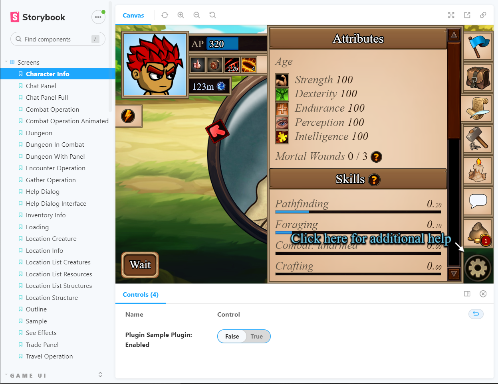

# Community Plugins

This is the section of the front-end code that hosts bespoke community solution approved to be used by players.
These plugins are shipped together with the game client, verified by the game dev team to make sure they adhere to the requirements outlined here.

## Development rules

There are several, non-exhaustive rules that may result in your submission be refused unless changed.

The rules are:
* The plugin must not perform any action on behalf of the player. That includes triggering any requests that perform an action or click or interact with existing UI elements to trigger them. Note: A permissible exception is that plugins are permitted to update their own settings.
* The plugin must not interact with user authentication or authorization.
* Pull requests for adding or updating plugins should be limited to code contained in the plugin's folder and, under additional scrutiny, additions of placeholders to the main codebase.
* Pull requests for adding or updating plugins should not include any additional npm/package dependencies
* Plugins that rely on any third party service should not include any hardcoded links - these should be configurable through the provided plugin settings API.
* Any external services that are utilized by the plugin should be made available open-source to the community. Exception to this may be considered in case of special circumstances.
* Plugin source must be entirely contained within the codebase source. This mean it's not allowed to pull any additional scripts or use JSONP transport method.

## How to develop a plugin

Start by creating a folder for your plugin. The name of that folder will be used as the identifier and should not be changed, as this would result in wiping all user settings for that plugin.
Naming format for the folder name is `lower-case-dashed`.

Then you need to create a `spec.json` file inside that folder:
```
{
  "name": "Name of your plugin",
  "author": "Your nickname",
  "enabled": true,
  "settings": [
    {
      "id": "text",
      "name": "Extra text",
      "type": "string"
    },
    {
      "id": "boop",
      "name": "Extra Boop",
      "type": "boolean"
    }
  ],
  "additions": {
    "map-location": "Box.vue"
  }
}
```

Please note that the settings can be empty or include any number of configurable settings.

Finally, the `additions` should map the UI slots to a component file within the plugin folder.
Each of those components will receive some props. All plugins will get `settings` prop that include that plugin's settings. Optionally, some slots will also receive some additional data depending on the slot they are placed into.

Currently available UI slots:
* `map-location`

## Preview your plugin

With the scaffolding set up you'll be able to preview your plugin using the storybook module.

To access it you'll need the following:
* Create an empty folder called `world` in the repository
* Create an empty folder called `server` in the repository
* You need to have `NodeJS` version 14
* You need to have `yarn` package manager installed
* You need to install project's dependencies by running 
```
yarn
```
* Finally, you can start storybook by running
```
yarn storybook
```

If your plugin is configured correctly you should see a toggle for your plugin in the actions section:

